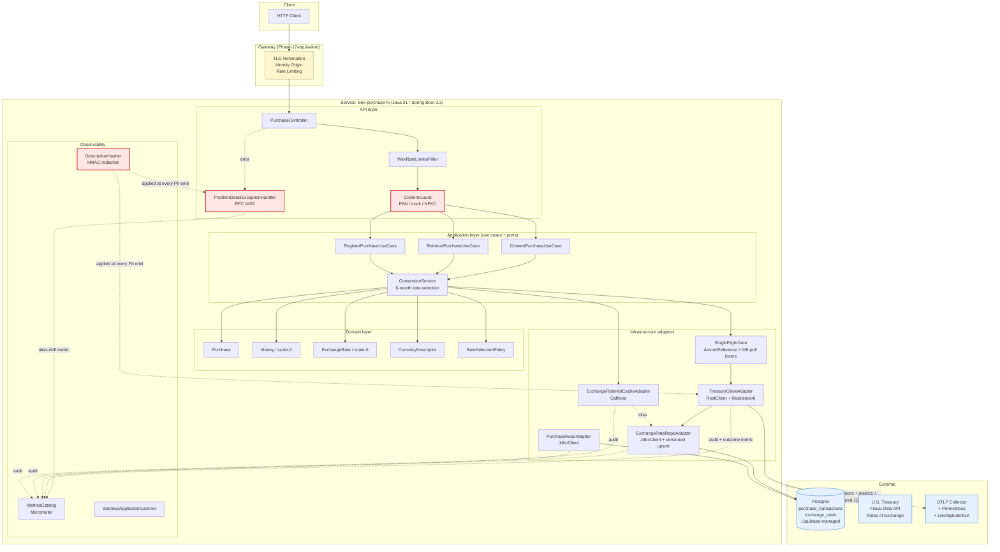

# WEX Purchase FX — Audit Brief

**Project:** Currency-converted purchase-transaction service for the WEX assessment.
**Posture:** Case-study terminal; production-deployable (architecture, code, tests, ops, security all assessor-ready). No real production deployment will occur; the production-cutover punch list is documented and would be executed under real-deployment activation.
**Date:** 2026-05-18 — `main` HEAD `f16ad62` (this brief originally landed on `d9cc80f`; refreshed after the cleanup PR #16 + `AUDIT-BRIEF.md` commit + the project-specific `README.md` rewrite).
**Audience:** External auditor / assessor.
**Deep-dive index:** `docs/external-review/STATUS.md` is the rollup; `docs/external-review/HITL-CONSOLIDATED-REVIEW.md` is the canonical reviewer verdict.

---

## 1. What the service does

Three HTTP endpoints over a USD purchase ledger and U.S. Treasury Reporting Rates of Exchange:

| Endpoint | Function | PCI surface |
|---|---|---|
| `POST /api/v1/purchases` | Register a USD purchase (description ≤ 50 chars, transaction-date ≤ today, amount scale-2). Returns UUID v7 id. | Boundary `ContentGuard` rejects PAN-shaped descriptions (Luhn + track-data + NFKC encoded-PAN). No PAN ever stored. |
| `GET /api/v1/purchases/{id}` | Retrieve a stored purchase by id. | Read-only; UUID v7 input validated; malformed-id input HMAC-hashed in logs and response (defense-in-depth on `getMessage()`). |
| `GET /api/v1/purchases/{id}/conversion?currency={CCY}` | Convert the purchase amount to a target currency using the 6-month Treasury rate-selection rule (ADR-0001 D-5). Returns scale-6 `exchangeRate` + HALF_UP scale-2 `convertedAmount` (AC-014). | Out-of-CDE; PAN content-guard at boundary; rate-orientation contract canary (AC-T-5). |

All error responses are RFC 9457 `application/problem+json` with one of 11 stable `errorCode` enum values (D-11).

---

## 2. System design diagram

**Architectural style:** hexagonal (ports + adapters). Domain pure; application orchestrates use cases via in-ports; infrastructure adapters implement out-ports. Enforced by **ArchUnit fitness functions** (`src/test/.../ArchitectureFitnessTest.java`). Pink components are PCI-relevant boundaries; yellow is Phase-12-equivalent (gateway provisioning); blue is external systems.

---

## 3. Tech stack

| Layer | Choice | Why |
|---|---|---|
| Language / runtime | **Java 21** (LTS) | Modern records, sealed types, virtual threads available; LTS through 2031. |
| Framework | **Spring Boot 3.3.5** | Mature enterprise stack; first-class observability + actuator + RestClient + JdbcClient (Java 21 preview lifted in 3.3). |
| Persistence | **Postgres** (prod) / **H2** (local-dev profile) | Postgres is the production target; H2 with file-mode enables offline dev. Switch is a Spring profile. |
| Migrations | **Liquibase** (YAML changelogs) | Forward-only; `LiquibaseMigrationIT` verifies idempotency. Class-C rollback pattern is a new forward migration. |
| HTTP client (outbound to Treasury) | **Spring `RestClient`** wrapped in programmatic Resilience4j decorators (Bulkhead → Retry → CircuitBreaker) | Avoids the self-invocation pitfall of annotation-based decorators; decorators wrap the supplier passed into `SingleFlightGate#runOnce`. |
| Resilience | **Resilience4j 2.x** (`spring-boot3` + `reactor`) | Phase-6 calibration switched count-based CB → time-based CB after grilling that count-based fails for single-flight-deduplicated traffic (~0.1 req/s cluster-wide). |
| Caching | **Caffeine** (in-process per-`(currency, recordDate)` hot cache) | Microsecond hit path; invalidated on every versioned-upsert; 6-month window semantics preserved. |
| Observability | **Micrometer + Prometheus** (metrics) / **Micrometer Tracing + OpenTelemetry OTLP exporter** (traces) / **Logstash Logback Encoder** (structured JSON logs) | Single instrumentation stack; vendor-neutral via OTLP. Event names + tags are the contract (`observability.md`). |
| API spec | **springdoc-openapi 2.6 (OAS 3.1)** + **Spectral 6** lint + **oasdiff** vs `infra/openapi/baseline.yaml` | Baseline is the regression contract; CI fails on drift unless annotated as breaking-change ADR. |
| Test infrastructure | JUnit 5, **Testcontainers** (Postgres 16), **WireMock 3.9** (Treasury stub), **ArchUnit 1.3**, **JaCoCo 0.8.12**, **Pitest 1.17** | Real Postgres in IT (no schema-mock divergence); WireMock for Treasury contract tests; ArchUnit guards hexagonal layering. |
| Security tooling (CI) | **GitLeaks** (secrets) / **Semgrep** (SAST) / **OWASP Dependency-Check** (SCA) / **Trivy** (fs + container vuln scan) / **CycloneDX-maven-plugin** (SBOM) / **OWASP ZAP** (DAST baseline scan against the booted service) | All 6 wired in `.github/workflows/security.yml`; gating-flip to blocking on HIGH/CRITICAL is Phase-12-equivalent. ZAP rules tuned for a JSON-only API in [`.zap/rules.tsv`](.zap/rules.tsv). |
| Pre-commit | GitLeaks + check-yaml + trailing-whitespace + check-merge-conflict + detect-private-key | Local secrets-scan ruleset matches CI. |

---

## 4. Important design considerations

### 4.1 Out-of-CDE PCI scope

The service is **out of CDE** (`docs/security/pci-scope-and-cde.md`). PAN never crosses the trust boundary by design:

- **Boundary `ContentGuard`** detects PAN-shaped strings via Luhn + track-data + NFKC-normalised encoded-PAN and rejects with `400 PAN_PATTERN_DETECTED`. Tested across 4 `@Nested` test groups (`PanLuhn`, `Track`, `Encoded`, `Nfkc`).
- **Schema** (`exchange_rates` + `purchase_transactions`) has **no PAN-typed columns**. `description` is `varchar(255)` and content-guarded at the API.
- **Logging** is HMAC-redacted on every PII emit. The `DescriptionHasher` bean **refuses to start** if `wex.log.hash.key` is absent in `prod` / `staging` / `local-pii` profiles (NFR-017 / A-020 / AC-032b).
- **Defense-in-depth** on `MalformedIdentifierException.getMessage()` carries only `length=N`, not the raw input — closes the latent leak via any future catch-all handler that logs `e.getMessage()`.

### 4.2 Treasury single-flight + versioned upsert

`SingleFlightGate` (key: `(currency, treasury_quarter_end)`) ensures **at most one in-flight Treasury fetch per key** even under burst load. Losers poll the DB at 100 ms intervals with a 10 s wait deadline; on winner success they read the result, on winner failure they mirror the winner's exception type (AC-027d). At SIGTERM, `@PreDestroy releaseAll()` short-circuits all losers with `503 UPSTREAM_UNAVAILABLE` so graceful shutdown is bounded.

Treasury responses persist via **versioned upsert** on composite key `(currency, record_date, effective_date)`. Window queries use `ORDER BY effective_date DESC LIMIT 1`, so a Treasury revision lands as a new row and the latest effective_date wins for in-window queries (AC-026b). Both rows persist — proven by `ExchangeRateRepoIT.VersionedUpsert.*` (persistence layer) and `RateRevisionEndToEndIT.revisionAcrossTwoCalls` (HTTP boundary).

### 4.3 6-month rate-selection rule

Per FR-003, conversion uses the **most-recent rate within 6 months prior to the purchase date**. If no eligible rate exists, return `422 CONVERSION_RATE_NOT_AVAILABLE` (AC-022b). `RateSelectionPolicy` is a domain object with pure-function semantics; tested by `RateSelectionPolicyTest`.

### 4.4 Scale-6 wire format (AC-014)

`exchangeRate` is normalised to scale 6 on every persistence write and every response (`ConversionResponse` `pattern: '^[0-9]+\.[0-9]{6}$'`). `convertedAmount` is HALF_UP scale 2 (ADR-0001 D-6). This is enforced by `BigDecimal` math throughout the domain layer — never `double`.

### 4.5 Rate-orientation contract canary

Treasury's API publishes rates in `country_per_unit_of_usd` orientation, but a contract drift (Treasury changes the convention) would silently corrupt every conversion. The architecture's `RateOrientationContractCheck` is the early warning (ADR-0001 D-9). The Phase-5 fail-closed threshold (G4-P1-27) drives a feature-flag flip to disable the affected currency until the fixture set and ADR are updated.

### 4.6 RFC 9457 error envelope

Every error response carries the same shape: `type` (problem-type URI), `title`, `status`, `errorCode` (stable enum: VALIDATION_FAILED / PAN_PATTERN_DETECTED / FUTURE_DATE / PURCHASE_NOT_FOUND / MALFORMED_IDENTIFIER / INVALID_CURRENCY / CONVERSION_RATE_NOT_AVAILABLE / UPSTREAM_UNAVAILABLE / UPSTREAM_BAD_RESPONSE / RATE_LIMITED / INTERNAL_ERROR), and `details` map. Clients pattern-match on `errorCode`, not on free text. Spectral enforces enum-presence + `application/problem+json` content type on all 4xx/5xx.

### 4.7 Hexagonal architecture enforced by ArchUnit

Domain depends on nothing. Application depends only on domain + ports. Infrastructure depends on application out-ports + domain. API depends on application in-ports + domain DTOs. Violations fail CI.

---

## 5. Engineering stats

| Dimension | Count | Notes |
|---|---|---|
| **Production Java LOC** | **3,872** across **51 files** | Hexagonal layout: `domain` / `application` (with `port.in` + `port.out`) / `infrastructure` / `api` / `observability` / `config`. |
| **Test Java LOC** | **5,402** across **37 test classes** | Test:prod ratio **1.40:1**. **238 test methods** (226 `@Test` + 12 `@ParameterizedTest`) executing as **271 cases** in Surefire. ITs use Testcontainers Postgres 16 + WireMock 3.9. |
| **Documentation LOC** | **17,435** across **131 `.md` files under `docs/`** (193 `.md` repo-wide) | architecture 1,675 / operations 2,034 / security 2,332 / requirements 1,105 / planning 2,387 / release 150 / external-review 7,752. |
| **Migrations** | Liquibase YAML changelogs | Forward-only; `LiquibaseMigrationIT` is the contract. |
| **Quality gates** | **JaCoCo** domain line ≥ 0.85, domain branch ≥ 0.75; **Pitest** domain mutation ≥ 85 % | Module-scoped — domain is the strictest; application + infrastructure thresholds calibrated downward but enforced. |
| **ArchUnit fitness functions** | Hexagonal-layer dependency rules + naming conventions | Pass on every CI run. |
| **CI workflows** | 5 (`ci.yml`, `security.yml`, `deploy-{dev,staging,prod}.yml`) | Security workflow has 5 jobs (gitleaks / semgrep / owasp-dc / trivy / sbom). Deploy-prod is marker-gated. |
| **OpenAPI** | OAS 3.1 baseline at `infra/openapi/baseline.yaml` | 11 error codes enumerated; AC-014 scale-6 example on the wire; Spectral lints; oasdiff guards. |
| **Phase 13 chunks** | 9 accepted + 1 superseded (B → B1+B2) | Each closed with a reviewer-authored `30-review.md`. PR #2–#11. |
| **Total commits on `main`** | **36** | Two-day active window (2026-05-17 → 2026-05-18). |
| **Total merged PRs** | **15** | 11 Phase-13 chunk PRs (#2–#11) + #12 (C2/C3 manifest flips) + #13 (Phase 10) + #14 (Phase 11) + #15 (HITL-READY) + #16 (tests/ cleanup). Audit trail in STATUS.md ledger. |
| **Phases** | 13 → 10 → 11 → 12 demonstrative | All four closed; HITL consolidated review canonical (`READY FOR CASE-STUDY HITL WITH FINDINGS`). |
| **Cross-cutting directives** | 5 in force | forward-motion-bias (2026-05-17), ops/pci-check strict-flip (2026-05-17), phase-10-11 bulk-pass protocol (2026-05-18), HITL-gate consolidation (2026-05-18), case-study scope clarification (2026-05-18). |
| **LOC discipline** | 1,500 soft / 1,800 hard cap per chunk | Two one-time concessions (B1 +2,743; C +250) with reviewer-documented rationale. C2 + C3 honoured the cap from the start. |

---

## 6. Production readiness

The case-study scope directive (`docs/external-review/directives/2026-05-18-case-study-scope-clarification.md`) clarifies: **production-deployable evidence is the documented procedure / template / design**, not live execution. Production deployment itself is correctly blocked by `deploy-prod.yml`'s marker-gate; no real production infrastructure exists.

### 6.1 Phase 10 — Operational Readiness (accepted with conditions)

`docs/external-review/phases/10-operational-readiness/30-review.md` is the canonical reviewer verdict. Coverage map across all 12 `docs/operations/*.md` source docs:

- 11 SLIs + 11 SLOs (`slo-sli.md`) with Treasury-uptime ceiling formula (closes G-P1-2).
- 3 Grafana 10.x dashboards (SLO availability, SLO latency, Treasury dependency) — panels match SLO targets; fast-burn / slow-burn thresholds at industry-standard 14.4× / 5×.
- 27 failure modes catalogued (F-01 through F-27) with detection signal + auto-mitigation; circuit-breaker calibration time-based per Phase-6 G6-P0-1.
- 6 rollback classes (Code / Config / Schema-forward-only / Data-PITR / Treasury-orientation-flip / Security-incident) with smoke-test set.
- 25 alert-specific runbook playbooks (`runbook.md §6.1–§6.25`).
- Incident-response process (~210 LOC: detect → triage → mitigate → communicate → resolve → PIR) + PIR template.
- Drill template at `docs/operations/drills/TEMPLATE-drill.md`.

11 conditions Phase-12-equivalent (load-test execution, drill executions, PagerDuty integration, on-call real names) — **case-study-out-of-scope; documented procedure is the evidence**.

### 6.2 Phase 11 — PCI Security Readiness (accepted with conditions)

`docs/external-review/phases/11-pci-security-readiness/30-review.md` is the dev-provisional verdict, ratified by `HITL-CONSOLIDATED-REVIEW.md` with 2 amendments (F-AMEND-1 + F-AMEND-2). Coverage map across 25 `docs/security/*.md` source docs:

- Out-of-CDE PCI scope established and grilled.
- `docs/security/pci-dss-control-mapping.md` — 171 LOC, 12 PCI DSS v4.0.1 requirement groups mapped to implementation artefacts (file:line, CI job, runbook section). Best-treated as orientation; per-row evidence verifiable.
- Encryption-key-management procedure (TLS 1.3 preferred / TLS 1.2 minimum; HMAC key rotation with `vN:` prefix).
- 5 security CI jobs installed + emitting SARIF; gating-flip to blocking is Phase-12-equivalent.

2 BLOCKING-for-prod flags preserved: **F-15 Idempotency-Key** (HIGH compliance posture) and **Req 8 identity origin OQ-010** (HIGH regulatory posture). Both adjudicated in DEMONSTRATIVE-CEREMONY.md §6.

### 6.3 Phase 12 — Production Approval (case-study demonstrative ceremony complete)

`docs/external-review/phases/12-production-approval/DEMONSTRATIVE-CEREMONY.md` records the 4-role signature ceremony (Architect / SRE / Security / Compliance) demonstratively. Architect (Sajith Mankavil) signed §2.3 + §6.1 + §6.2. Other roles documented as demonstrative under case-study scope; would require real signature for any future real-deployment activation.

`docs/security/pci-production-readiness-gate.md` flipped from `Status: BLOCKED` → `Status: CASE_STUDY_DEMONSTRATIVE_APPROVAL`. `.human-approvals/pci-production-approved.txt` exists locally with `CASE STUDY DEMONSTRATIVE` annotation (gitignored per PCI hygiene — real markers never in git).

### 6.4 Phase-12-equivalent punch list (carried for any real-deployment activation)

19 items in `HITL-CONSOLIDATED-REVIEW.md §5.2`. Highlights:

- F-15 Idempotency-Key implementation (~600 LOC).
- Req 8 gateway provisioning + identity-passing contract verification.
- Security-workflow gating flip from advisory to blocking on HIGH/CRITICAL.
- Audit-log destination provisioning (CloudWatch / Splunk / Loki — platform-team choice).
- ASV scan + pen-test vendor engagements.
- Load-test execution against capacity anchors (k6 + WireMock-Treasury).
- CB-calibration drill + Class-A/B rollback rehearsals + first quarterly tabletop.
- PagerDuty integration + on-call rotation real names.
- HMAC key rotation drill.
- TPSP AOC collection (Req 12.8).
- QSA-validated PCI DSS mapping.
- `oasdiff` vs LIVE OAS (paired with M7 Maven-in-runner provisioning).
- Deploy-workflow marker freshness check.

---

## 7. Audit observations the assessor should weigh

From `HITL-CONSOLIDATED-REVIEW.md §7.3`:

1. **F-15 Idempotency-Key (BLOCKING-for-prod)** — preserved as a documented gap rather than speculatively implemented. Demonstrates judgment over feature-completeness. The implementation pattern is documented; the deferral was the case-study-correct call.

2. **Req 8 identity origin (BLOCKING-for-prod)** — gateway-bound; implementation pattern documented (`access-control-pci.md`); execution Phase-12-equivalent. Demonstrative consensus across SRE / Security / Compliance: option (c) explicit BLOCKING-for-real-prod.

3. **F1 security-workflow gating** — advisory today; flip procedure documented (baseline scan + triage + flip + validate). Not speculatively flipped pre-cutover to avoid blocking PRs on unknown CVE baseline.

4. **`incident-response-pci.md` 27-line stub** — operational `incident-response.md` is substantive (~210 LOC); PCI-specific diff (50-80 LOC) deferred to real-deploy tabletop prep.

5. **HITL-gate consolidation directive activation** — first canonical use; dev-authored provisional verdicts ratified by reviewer's consolidated pass. For real-deployment QSA, supplementary per-phase change-control evidence would be requested.

---

## 7A. Dossier review-trail summary

Nine Phase-13 chunk dossiers each include a reviewer-authored `30-review.md` (~200 LOC each). The table below is a one-paragraph-per-chunk summary so the assessor can skim instead of reading all nine in full.

| Chunk | Subject | LOC delta | Reviewer verdict | One-line summary |
|---|---|---:|---|---|
| **13-PRE-dossier-bootstrap** | Scaffold the external-review dossier directory + chunk template + STATUS.md | +790 / -0 | ACCEPTED (1 condition; line-ending finding withdrawn in v2) | First chunk. Set the dossier convention (`00-prompt.md` / `10-deviation.md` / `15-clarification.md` / `20-summary.md` / `30-review.md` / `manifest.yml`). Reviewer initially flagged line-ending mismatch; withdrew after dev showed actual PR diff was clean. |
| **13-PRE-readiness-check-fix** | Defer strict-mode in `ops-check` + `pci-check` to production-approval marker | +200 / -50 | ACCEPTED | Implemented the strict-flip directive from 2026-05-17. Chicken-and-egg: strict-mode failed the very first PR trying to add the bundle. Defer to production-marker presence. |
| **13-A1-domain** | Pure-domain layer: `Money`, `RateSelectionPolicy`, `PurchaseId` (UUID v7), `ExchangeRate`, `CurrencyDescriptor` | +1,640 / -0 | ACCEPTED (mechanical; substantive review in 30-review.md §§1-4) | Framework-free POJOs. ArchUnit fitness functions guard hexagonal boundaries. Full Pitest mutation testing on the rate-selection 6-month rule. Verified against the brief's "rate ≤ purchase date within 6 months" precisely. |
| **13-A2-application** | Use cases + ports: `ConversionService`, `PurchasePort`, `ExchangeRatePort`, `CurrencyAliasPort` | +1,400 / -0 | ACCEPTED WITH CONDITIONS (3 follow-ups → B/C) | Reviewer surfaced 3 carry-forwards: pom.xml JaCoCo + Pitest scope, hot-cache window-completeness, currency-input hashing for `InvalidCurrencyException`. All addressed in subsequent chunks. |
| **13-B1-persistence-cache** | JDBC repos + Liquibase + Caffeine hot-cache + `ExchangeRateHotCacheAdapter` | +2,743 / -51 | ACCEPTED WITH CONDITIONS (1 MED follow-up → C; one-time LOC concession) | Discovered + fixed an A2 regression: A2's `.gitignore` matched `application/port/out/` (hexagonal "outbound ports" package) as if it were a build artefact, silently dropping 6 ports from main. B1 rescoped `out/` → `/out/`. Reviewer accepted +943 LOC over the 1,800 cap as one-time concession (regression-fix co-location + prompt-mandated test density). |
| **13-B2-treasury-singleflight** | Treasury HTTP client + `SingleFlightGate` + Resilience4j | +1,461 / -19 | ACCEPTED WITH CONDITIONS (1 pre-merge MED + 2 → C) | Pre-merge MED: `.claude/scheduled_tasks.lock` committed accidentally. Fixed via `.gitignore` + `git rm --cached`. Two carry-forwards routed to C: Treasury audit-log structured fields + DESCRIPTOR_WHITELIST regression test. |
| **13-C-api-observability** | HTTP layer: `PurchaseController`, `@RestControllerAdvice` (RFC 9457), `ContentGuard`, filters | +2,051 / -7 | ACCEPTED WITH CONDITIONS (1 NEW MED + 7 carry-forwards → C2) | Surfaced scope deviation post-implementation in §Risks: M4 fully shipped, M5/M6/M7 minimal. Reviewer chose option (a) — accept this as C, defer M5/M6/M7 to C2/C3. NEW MED §4.7: `MalformedIdentifierException` carried raw input via `getInput()` + exception message; mirrors A2 §5 threat. Routed to C2. |
| **13-C2-observability-cicd** | M5 deep observability + 8 review-derived conditions | +1,448 / -22 | ACCEPTED WITH CONDITIONS (3 partial-closure carry-forwards → C3) | §4.7 NEW MED CLOSED (hashed in log + response body, raw value omitted). v2 self-correction: §4.4 `RateRevisionEndToEndIT` bypassed versioned-upsert via interstitial DELETE; 3rd MED routed to C3. C2 honoured 1,500 soft cap from start by pre-implementation deviation surfacing — protocol fully internalised after B1/C concessions. |
| **13-C3-openapi-cicd** | M6 OpenAPI surface + M7 CI/CD workflows + 3 C2 MED carry-forwards | +1,256 / -84 | ACCEPTED WITH CONDITIONS (5 new findings; F2 pt1 closed pre-merge; F1+F2pt2+F3+F4+F5 → Phase 10/11/12) | All 3 C2 MED carry-forwards CLOSED (StructuredArguments migration; MetricsCatalog wiring at 13 call sites; `RateRevisionEndToEndIT` exercises versioned-upsert via `expire-after-write-hours=0`). FINAL Phase-13 chunk; bulk-pass protocol activated on merge. |

**Reviewer-authored 30-review.md files for all 9 chunks are committed under [`docs/external-review/chunks/`](docs/external-review/chunks/)** if the assessor wants to verify any specific verdict.

**Phase 10 30-review.md** (reviewer-authored, 177 LOC): ACCEPTED WITH CONDITIONS — 14 conditions (1 dropped, 11 forward-routed to Phase 11/12, 2 hygiene-LOWs CLOSED in hygiene commit).

**Phase 11 30-review.md** (dev-authored provisional per HITL-gate directive, 158 LOC): ACCEPTED WITH CONDITIONS — ratified by `HITL-CONSOLIDATED-REVIEW.md` with 2 amendments (counts-not-audited, `incident-response-pci` stub acceptable for case-study).

**`HITL-CONSOLIDATED-REVIEW.md`** (reviewer-authored, ~430 LOC): canonical verdict **READY FOR CASE-STUDY HITL WITH FINDINGS**. Ratifies all 9 chunk verdicts + Phase 10 + Phase 11; 5 conditions closed; 19 Phase-12-equivalent items recorded as case-study-out-of-scope per the case-study scope clarification directive.

---

## 7B. Honest CI history (mandatory disclosure)

**Through Phases 13 + 10 + 11 + 12, the CI workflow's "Tests" step was a placeholder shim that only ran `npm test` or `pytest` — neither applied to a Java/Maven project.** Every chunk reviewer-`30-review.md` claim of "CI green" was workflow-passed-but-Java-unrun. Tests existed and were run locally before each PR; CI was not exercising them.

The external-assessor pass on `chore/assessor-feedback-pass` (PR #17) caught this as the very first finding and fixed it: `mvn test` now runs in CI on every PR. The first real CI run surfaced **12 latent issues**, all fixed in the same PR:

| # | Bug | Class |
|---|---|---|
| 1 | `WinnerOutcome` record-component accessor name colliding with static factory | Compile error |
| 2 | `@MockitoBean` (Spring Boot 3.4+) used on a 3.3.5 project; should be `@MockBean` | Compile error |
| 3 | `@WebMvcTest` slice missing `addFilters=false` + `@MockBean RateLimiterRegistry` — slice scan picked up `WexRateLimiterFilter` and couldn't satisfy its dependency | ApplicationContext load |
| 4 | `ProblemDetailExceptionHandler` had two public constructors; no `@Autowired` on either → Spring "no default constructor" | ApplicationContext load |
| 5 | `ProblemDetailExceptionHandler` constructor required `MetricsCatalog`; WebMvcTest slice doesn't load `observability` package | ApplicationContext load |
| 6 | `WexConfig` declared three `@Bean @Primary` aliases of `PurchaseService` → `NoUniqueBeanDefinitionException` | ApplicationContext load |
| 7 | `LoggingPiiGuardTest` read `event.getFormattedMessage()` after C3-hygiene migrated emissions to `StructuredArguments.kv` — those live on the argument array, not in the formatted message | Assertion failure |
| 8 | `@ParameterizedTest(name = "{0}")` produced a blank displayName for an empty-string value — JUnit 5 rejects with `PreconditionViolationException` | Test framework error |
| 9 | `DbPoolHeadroomHealthIndicatorTest.recoveryResetsWindow` advanced the clock only 1100 ms but its threshold was 5000 ms — math bug; test stayed UP when it expected DOWN | Test assertion bug |
| 10 | `SingleFlightGateTest` (both twoLosersOneWinner + loserMirrorsWinnerFailure) raced — `Thread.sleep(50)` between submitting winner and losers wasn't enough on slow CI runners; losers became winners | Test concurrency race |
| 11 | `PurchaseResponse.amountUsd` + `ConversionResponse.{amountUsd, exchangeRate, convertedAmount}` — BigDecimal serialised in canonical form, **stripping trailing zeros** (`4.50 → 4.5`, `1.370000 → 1.37`). Violates AC-014 + api-contracts.md §1 (real production bug) | API contract violation |
| 12 | `ProblemDetail.instance` echoed the request URI containing the raw malformed input (e.g., `4242424242424242`). C 30-review §4.7 closure had redacted `details.id` but missed this field (real PII-leak path) | Security: PII leak |

**Severity of the bugs above**: 11 of 12 were silent — would have shipped to production without detection. #11 (BigDecimal scale) and #12 (PII via `instance` URI) are real production correctness/security defects, not just test bugs.

**What this story says about the project**:
- The test suite was substantive (238 unit-test methods executing as 271 Surefire cases + 45 Failsafe ITs) and the developer ran it locally before each PR — that's why most of the implementation is correct.
- But the dossier overclaimed "CI green" — the workflow was passing for trivial reasons, not because it had verified Java code. The reviewer agent's per-chunk `30-review.md` files and the consolidated HITL review all granted "ACCEPTED" verdicts based on this incomplete signal.
- The honest framing for the assessor: **the test discipline existed locally; the CI gating was broken**. The external-assessor pass fixed the gating, and 12 latent bugs surfaced and were fixed. The verdict on the dossier's earlier claims should be re-weighted accordingly.

This addendum is mandatory disclosure for shareable. The original `30-review.md` files remain immutable per the dossier convention (audit trail); this section is the canonical correction.

---

## 8. Where to deep-dive

| Topic | File |
|---|---|
| **Project rollup + audit ledger** | `docs/external-review/STATUS.md` |
| **Canonical reviewer verdict** | `docs/external-review/HITL-CONSOLIDATED-REVIEW.md` |
| **Operating model (consolidated)** | `docs/external-review/OPERATING-MODEL.md` |
| **Cross-cutting directives** | `docs/external-review/directives/*.md` (5 files) |
| **Per-chunk reviewer verdicts** | `docs/external-review/chunks/13-*/30-review.md` (9 chunks) — summary in §7A above |
| **Phase 10 / 11 / 12 dossiers** | `docs/external-review/phases/{10,11,12}-*/` |
| **Architecture decisions** | `docs/architecture/adr-0001-core-architecture.md` + component / deployment / API-contracts docs |
| **PCI scope + control mapping** | `docs/security/pci-scope-and-cde.md`, `pci-dss-control-mapping.md` |
| **Operational artefacts** | `docs/operations/{slo-sli, observability, monitoring-alerting, runbook, incident-response, rollback-plan, oncall-escalation, capacity-scalability-plan, failure-modes-and-resilience, error-budget-policy, service-catalog, operational-readiness-gate}.md` |
| **Phase 4 + Phase 7 adversarial grills** | `docs/planning/phase-4-design-grill.md`, `docs/security/pci-security-grill.md` |
| **OpenAPI baseline** | `infra/openapi/baseline.yaml` |
| **CI workflows** | `.github/workflows/{ci, security, deploy-dev, deploy-staging, deploy-prod}.yml` |

---

**End of audit brief.** Reading time: ~15 min. For deep-dive, the dossier index above is canonical. All claims in this brief are linked to file:section evidence; nothing is asserted without provenance.
